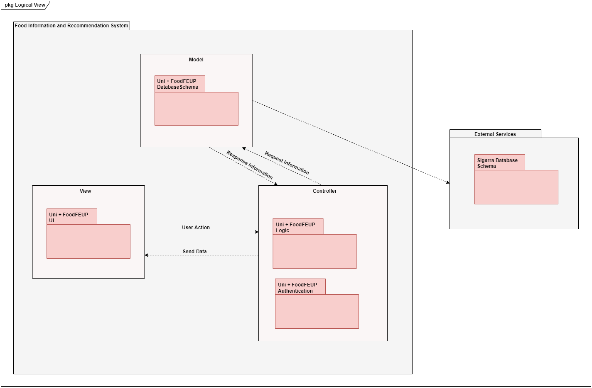

## Architecture and Design
The architecture of a software system encompasses the set of key decisions about its overall organization. 

A well written architecture document is brief but reduces the amount of time it takes new programmers to a project to understand the code to feel able to make modifications and enhancements.

To document the architecture requires describing the decomposition of the system in their parts (high-level components) and the key behaviors and collaborations between them. 

In this section you should start by briefly describing the overall components of the project and their interrelations. You should also describe how you solved typical problems you may have encountered, pointing to well-known architectural and design patterns, if applicable.

In this section it will be explained both logical and physical architectures of the project as some key aspects of its design.

This project will use the Model-View-Controller design pattern, where the program is divided into three interconnected elements that focus on a functional GUI.

  

     
### Logical architecture
The purpose of this subsection is to document the high-level logical structure of the code (Logical View), using a UML diagram with logical packages, without the worry of allocating to components, processes or machines.

It can be beneficial to present the system both in a horizontal or vertical decomposition:
* horizontal decomposition may define layers and implementation concepts, such as the user interface, business logic and concepts; 
* vertical decomposition can define a hierarchy of subsystems that cover all layers of implementation.

* `Uni + FoodFEUP UI`: responsible for how the user will interact
* `Uni + FoodFEUP Logic`: responsible for processing data
* `Uni + FoodFEUP Database Schema`: saves user feedback

### Physical architecture
Only two entities are present on FEUP Food's physical architecture: the app itself, that interacts with the user, and the server containing the database where the information is stored.

Regarding the technologies used, the frontend will depend on Flutter (with the Dart programming language) and the backend on SQLite.

### Vertical prototype
To help on validating all the architectural, design and technological decisions made, we usually implement a vertical prototype, a thin vertical slice of the system.

In this subsection please describe which feature you have implemented, and how, together with a snapshot of the user interface, if applicable.

At this phase, instead of a complete user story, you can simply implement a feature that demonstrates thay you can use the technology, for example, show a screen with the app credits (name and authors).
